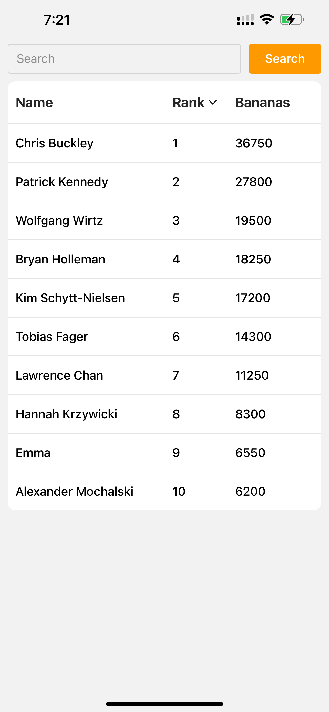
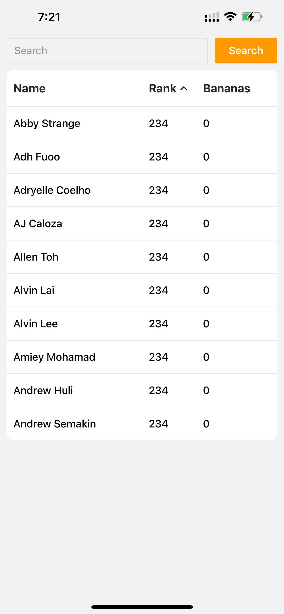
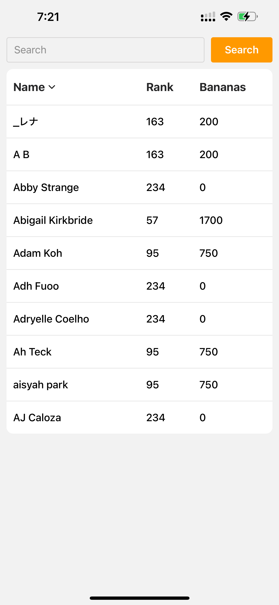
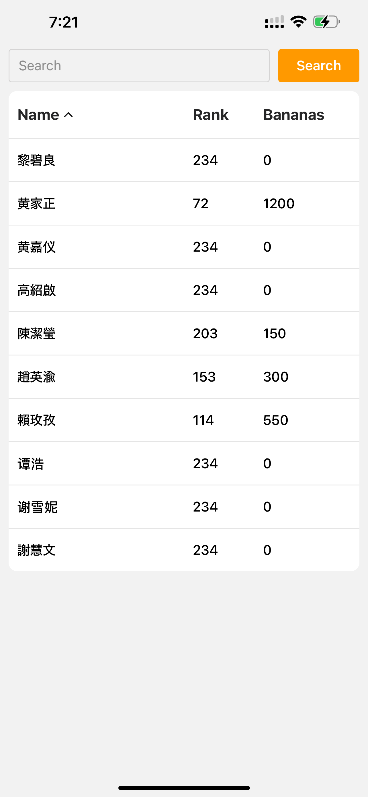
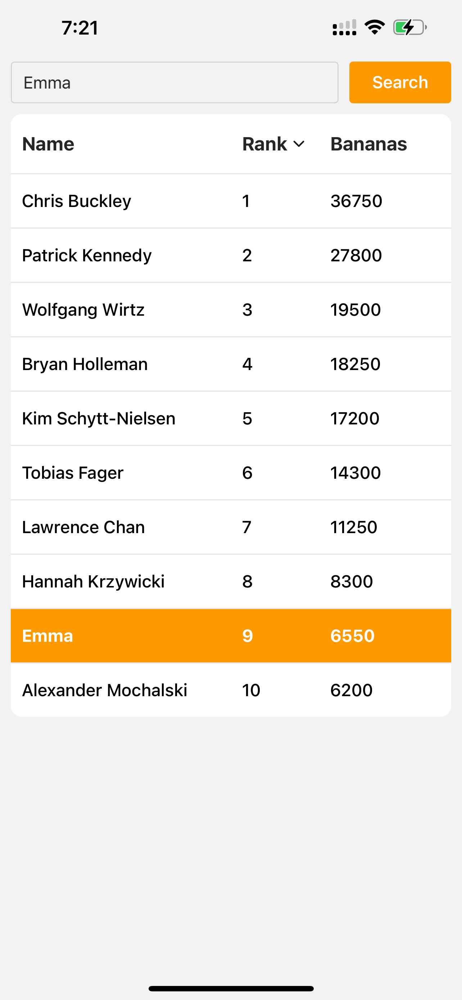
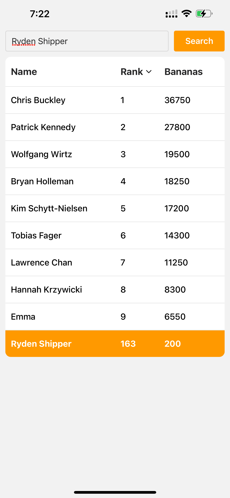
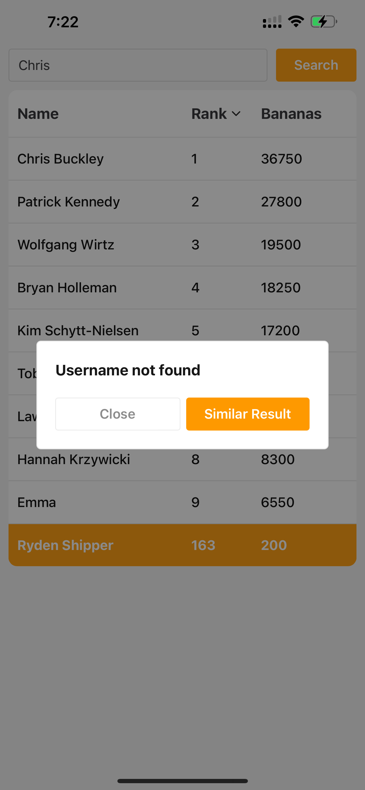
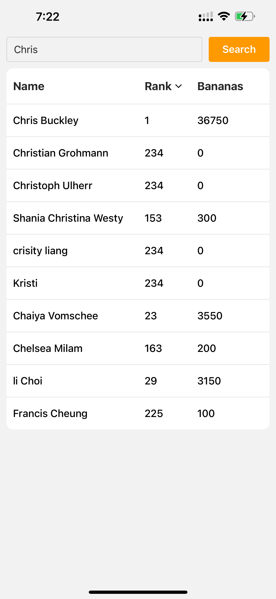

# Nel Sokchhunly Ling Assessment

## Overview

This project was developed as part of an assessment to showcase proficiency in:

- Frontend development with React Native
- State management using Redux
- Writing clean, maintainable code
- Unit testing with Jest

### Key Objectives

1. Implement a search user functionality in a leaderboard.
2. Manage application state effectively using Redux.
3. Provide user feedback with modals.
4. Demonstrate structured code organization.
5. Demonstrate fuzzy search functionality.
6. Implement unit tests for redux logic.
7. Usage of a component library (GlueStack).

## Technologies Used

- React Native Framework: Expo
- Typescript
- GlueStack (Component Library)
- Redux (State Management)
- Jest (Unit Testing Library)
- Fuzzy Search (Fuse.js)

## Setup and Installation

Follow these steps to set up and run the project locally:

1. Clone the repository:

    ```bash
   git clone https://github.com/Nel-sokchhunly/ling-assessment.git
    ```

2. Navigate to the project directory:

    ```bash
    cd ling-assessment
    ```

3. Install dependencies:

    ```bash
    npm install
    ```

4. Start the expo go development server:

    ```bash
    npx expo start
    ```

5. Open the Expo Go app on your mobile device and scan the QR code to run the app.

## Project Screenshots

### Default Sort Rank Ascending and Descending

|  |  |
|:-------------------------------------------------------------------------------------:|:---------------------------------------------------------------------------------------:|
| Rank Ascending                                                           | Rank Descending                                                             |

### Sort by Name Ascending and Descending

|  |  |
|:--------------------------------------------------------------------:|:----------------------------------------------------------------------:|
| Name Ascending                                                      | Name Descending                                                        |

### Exact Search Match

|  |  |
|:---------------------------------------------------------------------------------:|:---------------------------------------------------------------------------------------------------:|
| Exact Search Match In List                                                      | Exact Search Match Not In List                                                                    |

### No Exact Search Match and Fuzzy Search Match

|  |  |
|:------------------------------------------------------------------------------:|:-------------------------------------------------------------------------:|
| No Exact Search Match                                                        | Fuzzy Search Match                                                      |